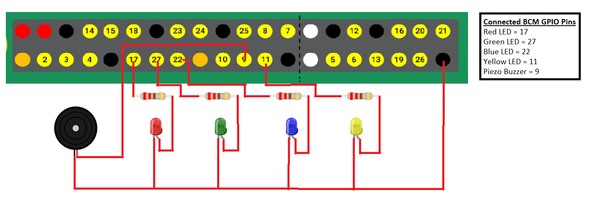

# Davood Says

Davood Says is a game that was developed in Python using Raspberry Pi's GPIO. The player should follow the correct pattern of the randomly generated colors issued by Davood (The Game) using WASD keys. The color is limited only to Red, Green, Blue, and Yellow.

Every correct sequence of colors that follows by the player as what Davood says (The game), the more it will level up and the game becomes more difficult by the means of appending one new generated color to the Davood's color pattern sequence.  Also, the LED displays that indicate Davood's color pattern sequence to instruct the player, become faster and faster for the thrill because the display delay of the LED decreases the more you level up in the means of 1.5 - (level * 0.05) second(s). The game will continue to display more LEDs and be difficult until the player fails to follow the correct pattern sequence of colors on what Davood says or the player meet level 30 of the game (Final Level).

## Gameplay Sample

https://user-images.githubusercontent.com/27999234/158933674-2cefd266-aea5-463d-a939-a46efdee10d3.mp4

The game has one piezo buzzer that will buzz every turn-on of each LED. The purpose of the buzzer is to help the player easily sync in the Davood's color pattern sequence on their mind and as an indicator if the game is ready to play, or if it's already game over. For the inputs, the player must press the 'W' key for Red LED, 'A' key for Green LED, 'S' key for Blue LED and 'D' key for Yellow LED on their computer keyboard.

## Circuit

